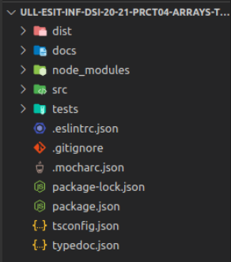
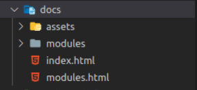
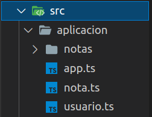
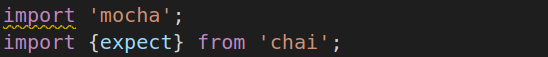
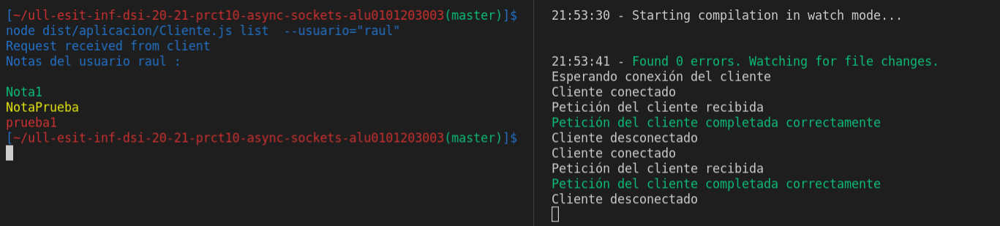

# Práctica 10: implementación de un cliente y un servidor de la aplicación de procesamiento de notas mediante Sockets en Node.js. Informe.
## Desarrollo de Sistemas Informáticos 
## Raúl Martín Rigor - alu0101203003@ull.edu.es

### Introducción

En este informe se resumen las actividades realizadas en la **práctica 10** para poner en práctica nuestros conocimientos de TypeScript sobre Sockets para trabajar en la manipulación de peticiones,respuestas y conexiones entre un cliente y un servidor... a través de la implementación de la aplicación de notas previamente desarrollada en la práctica 8. En esta práctica tambien haremos uso de los principios SOLID en la medida de lo posible.

### Objetivos

Al finalizar la práctica, habremos completado los siguientes objetivos:

* Saber establecer correctamente una conexión servidor-cliente mediante sockets.
* Hacer uso de peticiones y respuestas entre las dos partes de la conexión.
* Desarrollar una aplicación funcional utilizable desde el cliente que, a través del servidor, ejecute las funciones necesarias para cumplir con las posibilidades de la aplicacion de notas.

### 1. Creación y configuración del driectorio del proyecto.

#### 1.1. Estructura inicial

Para la creación de la estructura inicial, seguiremos los mismos pasos que en practicas anteriores ([práctica 4](https://github.com/ULL-ESIT-INF-DSI-2021/ull-esit-inf-dsi-20-21-prct04-arrays-tuples-enums-alu0101203003/blob/gh-pages/index.md)).

La estructura debería quedar similar a las siguientes fotos:

  

#### 1.2. Organización de los ficheros

Será necesario implementar las clases, servidor y cliente en ficheros diferentes. 
Los ficheros que dependan de otros (o de otros paquetes) requeriran de un `import` del recurso que necesiten:

 

#### 1.3. Testing y cubrimiento de código

Se usarán distintas herramientas (a través de GitHub Actions) para tener constancia de los resultados de las pruebas y del cubrimiento de código. Serán instaladas con la ayuda de sus respectivos tutoriales ([Tests de Node.js](https://drive.google.com/file/d/1hwtPovQlGvthaE7e7yYshC4v8rOtLSw0/view), [Coveralls](https://drive.google.com/file/d/1hwtPovQlGvthaE7e7yYshC4v8rOtLSw0/viewhttps://drive.google.com/file/d/1yOonmpVbOyvzx3ZbXMQTAPxvA3a7AE7w/view) y [SonarCloud](https://drive.google.com/file/d/1FLPargdPBX6JaJ_85jNsRzxe34sMi-Z3/view)).

### 2. Ejercicio

Paso a explicar la resolución del ejercicio y a adjuntar su código. Se mostrará una versión simplificada del enunciado del ejercicio (para verlo al completo con aclaraciones y pistas, consultar la [guía de la práctica](https://ull-esit-inf-dsi-2021.github.io/prct09-async-fs-process/).

Para poder resolver este ejercicio nos serán de utilidad ciertas herramientas de los paquetes [yargs](https://www.npmjs.com/package/yargs) y [chalk](https://www.npmjs.com/package/chalk), los cuales debemos instalar con sus correspondientes dependencias para el manejo de comandos y el color del texto. También será de vital importancia instalar el paquete `@types/node` para utilizar las APIs de [Node.js](https://nodejs.org/en/).

Todos los manejadores de comandos, métodos auxiliares... se pueden comprobar en el [código fuente de la práctica](https://ull-esit-inf-dsi-2021.github.io/prct10-async-sockets/) con el fin de no saturar este informe.

**Enunciado:**

Para este ejercicio se nos solicitan las mimas funcionalidades que en el ejercicio de la [práctica 8](https://ull-esit-inf-dsi-2021.github.io/prct08-filesystem-notes-app/). Las novedades (al tratarse de sockets) son las siguientes:

El servidor es responsable de hacer persistente la lista de notas de cada usuario:

* Guardar cada nota de la lista en un fichero con formato JSON. Los ficheros JSON correspondientes a las notas de un usuario concreto deberán almacenarse en un directorio con el nombre de dicho usuario.
* Cargar una nota desde los diferentes ficheros con formato JSON almacenados en el directorio del usuario correspondiente.

Un usuario solo puede interactuar con la aplicación de procesamiento de notas de texto a través de la línea de comandos del cliente. Los diferentes comandos, opciones de los mismos, así como manejadores asociados a cada uno de ellos deben gestionarse mediante el uso del paquete yargs.

#### 2.1 Cliente

Para conectar el cliente tendremos que declararlo como un socket conectado al puerto 60300, que será el que usaremos para escuchar en el servidor:

```ts
const client = connect({port: 60300});
```

El cliente se encargará de manejar la entrada de comandos para todos las funciones de la app. Para ello haremos uso de yargs al igual que en la práctica 8. Sin embargo, los manejadores de los comandos cambiarán para poder escribir en la conexión la petición que se le efectuará al servidor. Esta petición será de tipo RequestType y contendrá los atributos obtenidos por comando que serán usados por el servidor después para ejecutar el comando correspondiente.

```ts
/**
 * Comando add.
 * Añade una nota al directorio del usuario
 */
 yargs.command({
  command: 'add',
  describe: 'Añade una nueva nota',
  builder: {
    usuario: {
      describe: 'Nombre del usuario',
      demandOption: true,
      type: 'string',
    },
    titulo: {
      describe: 'Titulo de la nota',
      demandOption: true,
      type: 'string',
    },
    cuerpo: {
      describe: 'Cuerpo de la nota',
      demandOption: true,
      type: 'string',
    },
    color: {
      describe: 'Color de la nota',
      demandOption: true,
      type: 'string',
    },
  },
  handler(argv) {
    if (typeof argv.usuario === 'string' && typeof argv.titulo === 'string' && typeof argv.cuerpo === 'string' && typeof argv.color === 'string') {
      
      const req: RequestType = {
        type: 'add',
        user: argv.usuario,
        title: argv.titulo,
        body: argv.cuerpo,
        color: argv.color,
      };
      
      client.write(JSON.stringify(req) + '\n', (err) => {
        if (err) {
          console.log(chalk.red(`Error. No se pudo hacer la peticion al servidor: ${err.message}`));
        }
      });

    } else {
      console.log(chalk.red("Error. Comando mal especificado"));
    }
  },
});
```
El servidor manejara esta petición y, como resultado enviará una respuesta. Esta respuesta llegará como un mensaje y, para poderlo manejar correctamente, nos será de gran utilidad crear una subclase de EventEmitter que emita esta respuesta al cliente.

```ts
/**
 * Clase MessageEventEmitterClient.
 * Permite emitir al cliente la respuesta obtenida del servidor
 * a través de la coneccion establecida.
 * @param connection coneccion establecida
 */
export class MessageEventEmitterClient extends EventEmitter {
    constructor(connection: EventEmitter) {
      super();
  
        let wholeData = '';
        connection.on('data', (dataChunk) => {
            wholeData += dataChunk; 
        });

        connection.on('end', () => {
            const respuesta = JSON.parse(wholeData);
            this.emit('respuesta', respuesta);
        });
    }
}
```

Gracias a esto el cliente puede recibir feedback de como se ha efectuado la petición y, más importante aún, los datos resultantes de realizarla cuando estos sean necesarios.

Esta clase se encargará de recibir el mensaje por trozos, juntarlo y emitirlo como respuesta en formato JSON.

Esta respuesta será manejada por el cliente, el cual evaluará de que tipo se trata y como actuar en consecuencia. Para cada caso de respuesta a un comando posible se evaluará si la petición fue ejecutada correctamente y, si se da este caso, se mostrará el mensaje obtenido tras ejecutar la función; en el caso contrario, se mostrará el mensaje de error específico para cada petición.

```ts
var emit = new MessageEventEmitterClient (client);
  emit.on('respuesta', (respuesta) => {
    console.log('Request received from client');


    if (respuesta.type == 'add'){
      if (respuesta.success == true){
        console.log(respuesta.mensaje)
      } else {
        console.log(chalk.red("Error. La nota ya existe"));
      }
    }
```

Un ejemplo de feedback significativo que obtendrá el cliente del servidor se puede comprobar al ejecutar el comando `list` que devuelve como mensaje todas las notas de un usuario con su respectivo color:



#### 2.2 Servidor

El servidor se encargará de manejar la petición solicitada, ejecutar la función correspondiente según esta petición y generar la respuesta correspondiente para enviarla de vuelta al cliente. El servidor se creará con createServer y escuchará en el puerto indicado. Indicará cuando un cliente se conecta y se desconecta:

```ts
const server = createServer({allowHalfOpen: true}, (connection) => {
  console.log('Cliente conectado');
```
```ts
connection.on('error', (err) => {
    if (err) {
      console.log(chalk.red(`Error.No se pudo establecer conexión: ${err.message}`));
    }
  });

  connection.on('close', () => {
    console.log('Cliente desconectado');
  });
});

  server.listen(60300, () => {
    console.log('Esperando conexión del cliente');
});
```

Aquí también ayudará tener una clase que para manejar los mensajes de petición y emitirlos al servidor con el formato correspondiente:

```ts
/**
 * Clase MessageEventEmitterServer.
 * Permite emitir al servidor la petición del cliente
 * a través de la coneccion establecida.
 * @param connection coneccion establecida
 */
export class MessageEventEmitterServer extends EventEmitter {
    constructor(connection: EventEmitter) {
      super();
  
      let wholeData = '';
      connection.on('data', (dataChunk) => {
        wholeData += dataChunk.toString();
  
        let messageLimit = wholeData.indexOf('\n');
        while (messageLimit !== -1) {
          const message = wholeData.substring(0, messageLimit);
          wholeData = wholeData.substring(messageLimit + 1);
          this.emit('request', JSON.parse(message));
          messageLimit = wholeData.indexOf('\n');
        }
      });
    }
  }
```

Para crear las respuestas usaremos los resultados por las funciones de la clase Usuario (explicada en la [práctica8](https://github.com/ULL-ESIT-INF-DSI-2021/ull-esit-inf-dsi-20-21-prct08-filesystem-notes-app-alu0101203003)).

```ts
var emit = new MessageEventEmitterServer(connection);
  emit.on('request', (mensaje) => {
    console.log('Petición del cliente recibida');

    
    var usuario = new Usuario(mensaje.user);

    var resp :ResponseType = {
      type: 'add',
      success: false,
      mensaje: ""
    }
  
    if (mensaje.type == 'add'){
      var succ = usuario.añadirNota(mensaje.title,mensaje.body,mensaje.color);
      resp = {
        type: 'add',
        success: succ.success,
        mensaje: succ.mensaje
      }
    }
```

Como se pude comprobar, las funciones (como `añadirNota`) aportan un valor de retorno que ya no es booleano (pues podemos acceder a varios atributos dentro de él). Esto se debe a que es necesario cambiar las funciones previamente implementadas para que devuelvan una salida compuesta y poder conservar el mensaje correctamente para enviarlo en la respuesta a modo de feedback para el cliente. Veremos como ejemplo la función `listarNotas`:

```ts
    /**
     * Función listarNotas.
     * Permite mostrar todas las notas del directorio del usuario
     */ 
    public listarNotas(){
        var salida = {
            success: false,
            mensaje: ""
        }
        if (!this.existeUsuario(this.nombre)){
            return salida;
        } else {
            var titulosColoreados :string = `Notas del usuario ${this.nombre} : \n`
            fs.readdirSync(`src/aplicacion/notas/${this.nombre}`).forEach((item) => {
                var nota = fs.readFileSync(`src/aplicacion/notas/${this.nombre}/${item}`);
                var notaParseada = JSON.parse(nota.toString());
                titulosColoreados = titulosColoreados + `\n` + this.colorear(notaParseada.titulo,notaParseada.color);
                
                salida = {
                    success: true,
                    mensaje: titulosColoreados
                }
            });
            return salida;
        }
    }
```


### Conclusiones

Con esta práctica he aprendido a manejar los sockets y, con ello, conectar eficazmente un cliente con un servidor. Este tipo de conexiones ocurren el muchísimos programas que requieren la interacción remota. Esta herramienta me será muy útil para cualquiera de mis actuales y siguientes desarrollos.

### Bibliografía

A continuación se muestra una serie de recursos que han sido de gran utilidad para la realización de la práctica y de este informe:

Recurso| Dirección
-------|----------
Guía de la práctica | https://ull-esit-inf-dsi-2021.github.io/prct10-async-sockets/
Apuntes | https://ull-esit-inf-dsi-2021.github.io/nodejs-theory/
Sockets | https://ull-esit-inf-dsi-2021.github.io/nodejs-theory/nodejs-sockets.html

